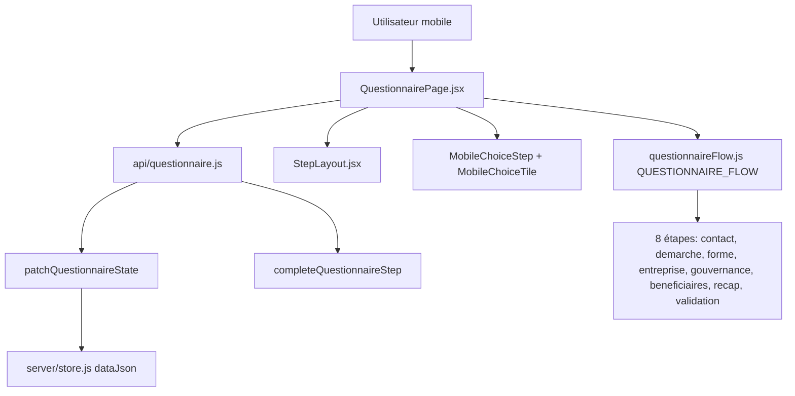

# Contexte ChatGPT – Questionnaire mobile interactif Greffio

> Document autonome à copier dans ChatGPT (ou autre LLM) pour cadrer la conception UX/UI et l’implémentation d’un questionnaire mobile **interactif**, **progressif** et **sans boutons « Valider »** perçus comme rébarbatifs.
>
> **Projet** : Greffio SaaS – formalités d’entreprise (William Establishments)  
> **Stack** : React + Vite, Capacitor (Android), API Express, déploiement web Hostinger + API VPS  
> **Dernière analyse codebase** : juin 2026 (Cursor)

---

## 1. Brief produit

### Demande utilisateur (verbatim reformulé)

> Je veux un modèle de questionnaire pour mon app mobile optimisé UI/UX qui fonctionne **à l’avancée au clic** (soit QCM et parfois saisir une info) et **avance progressivement**. Je ne veux plus des boutons « Valider » sur l’appli et des trucs boring – je voudrais quelque chose d’**interactif** pour mes questionnaires.

### Objectifs produit

| Objectif | Détail |
|----------|--------|
| Mobile-first | App Capacitor native + navigateur mobile (&lt;768px) |
| QCM | Sélection par tuile / carte → **avance immédiate** sans bouton |
| Saisie | Champs texte ponctuels → clavier natif, avance fluide dès réponse valide |
| Progression | Une question à la fois, barre de progression granulaire |
| Ton UX | Typeform / onboarding premium – **pas** formulaire administratif |
| Métier | Formalités françaises crédibles (création SAS/SASU/SARL/EI, modifications, établissements…) |
| Contrainte marque | **Ne pas refondre** la landing, la palette ni le design system Greffio |

### Non-objectifs

- Refonte visuelle globale (hero landing, tokens CSS, footer public)
- Changement du schéma API ou des clés `dataJson` dossier
- Exactitude juridique exhaustive sur tous cas particuliers (priorité : parcours fluide + checklist crédible)

---

## 2. Contexte produit Greffio

| Élément | Détail |
|---------|--------|
| **Produit** | SaaS d’assistance aux formalités d’entreprise (immatriculation, modifications, documents greffe) |
| **Marque** | Greffio – WILLIAM ESTABLISHMENTS |
| **URL prod** | `https://greffio.willentreprises.com` |
| **API** | `https://api.greffio.willentreprises.com` |
| **App mobile** | Shell Capacitor **remote** : charge le site live (pas de bundle web embarqué pour le contenu métier) |
| **Parcours client** | Questionnaire → dossier → coffre documents → statuts PDF → dépôt / suivi greffe |
| **Persistance** | Réponses dans `dossier.dataJson` via `PATCH /api/dossiers/:id/questionnaire` |
| **Autosave** | Debounce ~900 ms côté client à chaque modification |
| **Identité visuelle** | Bleu Greffio `#1e4d8c`, cartes blanches arrondies, typo Inter – **figée** |

### Parcours utilisateur typique (création SASU)

1. Choisir la démarche (création SASU)
2. Renseigner contact, entreprise, associés, bénéficiaires effectifs
3. Récapitulatif + validation
4. Génération statuts → dépôt pièces → paiement / formalités

---

## 3. Architecture technique actuelle

### Diagramme de flux



### Fichiers pivot

| Fichier | Rôle |
|---------|------|
| `src/lib/questionnaireFlow.js` | Source de vérité : étapes, champs, conditions, validation, catalogues démarches (~30 formalités) |
| `src/pages/QuestionnairePage.jsx` | Orchestration UI, autosave, groupes mobile, tap-to-advance |
| `src/components/questionnaire/MobileChoiceStep.jsx` | Écran QCM centré, barre progression, hint « Touchez pour continuer » |
| `src/components/questionnaire/MobileChoiceTile.jsx` | Tuile radio animée (Framer Motion) |
| `src/components/questionnaire/StepLayout.jsx` | Barre sticky « Continuer » / « Retour » |
| `src/components/questionnaire/QuestionContinueButton.jsx` | Bouton pill bleu – **élément à réduire / remplacer** |
| `src/components/questionnaire/DemarchePicker.jsx` | Sélection formalité + catégories (multi-étapes mobile partiel) |
| `src/utils/platform.js` | `isMobileQuestionnaireViewport()` = Capacitor natif OU web &lt;768px |
| `src/mobile/entries/QuestionnaireEntry.jsx` | Wrapper mobile (réutilise `QuestionnairePage`) |
| `src/api/questionnaire.js` | `getQuestionnaireState`, `patchQuestionnaireState`, `completeQuestionnaireStep` |

### Détection viewport mobile questionnaire

```javascript
// src/utils/platform.js
export const isMobileQuestionnaireViewport = () => (
  isCapacitorNative() || isMobileBrowserViewport()
);
// isMobileBrowserViewport = !Capacitor && innerWidth < 768
```

### Étapes du questionnaire (`QUESTIONNAIRE_FLOW`)

| id | title | Champs principaux |
|----|-------|-------------------|
| `contact` | Qui effectue la démarche ? | initiatorType, prénom, nom, email, tel, SIREN PM… |
| `demarche` | Type de formalité | typeFormalite, SIREN société existante |
| `forme` | Structure juridique | formeJuridique |
| `entreprise` | Informations société | dénomination, siège, activité, capital… |
| `gouvernance` | Associés / dirigeant | associates_minor_panel, dirigeant |
| `beneficiaires` | Bénéficiaires effectifs | beneficial_owners_picker |
| `recap` | Récapitulatif | recap_summary |
| `validation` | Validation finale | validationConfirmed (checkbox) |

### Types de champs supportés

`select`, `checkbox`, `text`, `email`, `tel`, `date`, `number`, `textarea`, `associates_minor_panel`, `beneficial_owners_picker`, `recap_summary`

### API questionnaire

```javascript
// src/api/questionnaire.js
export const patchQuestionnaireState = async ({ dossierId, dataPatch, progressPercent }) =>
  apiPatch(`/api/dossiers/${dossierId}/questionnaire`, { dataPatch, progressPercent });

export const completeQuestionnaireStep = async ({ dossierId, stepId, dataPatch, progressPercent }) =>
  apiPost(`/api/dossiers/${dossierId}/complete-step`, { stepId, dataPatch, progressPercent });
```

---

## 4. État actuel – ce qui existe vs ce qui manque

### Déjà implémenté (mobile)

1. **QCM select / checkbox binaire** → `MobileChoiceTile` + auto-avance **180 ms** après sélection
2. **Bouton « Continuer » masqué** quand un seul champ select/checkbox est affiché (`hideContinueOnMobileChoice`)
3. **Groupement mobile** via `resolveMobileFieldGroups()` – regroupe parfois plusieurs champs (identité, coordonnées)
4. **`DemarchePicker`** avec prop `onAdvance` en mode mobile
5. **Autosave silencieux** + `ProgressCircle` / barre fine par question
6. **Asset Play Store** « questionnaire progressif » (`assets/play-store/source/phone/03-questionnaire-progressif.html`)

### Logique tap-to-advance (extrait réel)

```javascript
// src/pages/QuestionnairePage.jsx

const hideContinueOnMobileChoice = isMobileTapToAdvanceGroup(activeGroup);
// isMobileTapToAdvanceGroup = 1 seul champ && type select ou checkbox

const handleTapFieldUpdate = (field, value) => {
  updateField(field, value);
  requestMobileTapAdvance(field.key);
};

useEffect(() => {
  const pendingKey = pendingTapAdvanceRef.current;
  if (!pendingKey || !isMobileChoicePresentation) return undefined;
  if (!canAdvanceCurrentGroup) { pendingTapAdvanceRef.current = null; return undefined; }
  pendingTapAdvanceRef.current = null;
  const timer = window.setTimeout(() => { void goNext(); }, 180);
  return () => window.clearTimeout(timer);
}, [formData, activeGroup, canAdvanceCurrentGroup]);
```

```javascript
// src/components/questionnaire/MobileChoiceStep.jsx

export const isMobileTapToAdvanceGroup = (fields = []) => (
  fields.length === 1 && isMobileChoiceField(fields[0])
);
// isMobileChoiceField = type select ou checkbox
```

### Encore « boring » / boutons visibles

| Zone | Problème |
|------|----------|
| Champs texte, email, tel, date, textarea | Bouton « Continuer » **toujours visible** |
| Groupes multi-champs (ex. prénom + nom) | Pas de tap-to-advance ; formulaire classique |
| `AssociatesMinorPanel` | Panneau composite, pas de micro-questions |
| `BeneficialOwnersPicker` | Sélection multi, logique métier dense |
| `DemarchePicker` | Catégorie → formalité : partiellement tap-to-advance |
| Étapes recap / validation | Confirmation explicite requise (légitime) |
| Desktop / tablette ≥768px | Layout formulaire multi-champs intentionnel |

### Regroupement mobile actuel (source du multi-champ)

```javascript
// src/lib/questionnaireFlow.js – MOBILE_FIELD_GROUP_SPECS (extrait)

const MOBILE_FIELD_GROUP_SPECS = Object.freeze({
  contact: [
    ['initiatorType'],           // ← tap-to-advance OK (select seul)
    ['firstName', 'lastName'],   // ← 2 champs = bouton Continuer
    ['nationality'],
    ['birthDate'],
    ['companyCountry', 'companySiren', 'companyName'],
    ['email', 'phone'],
  ],
  demarche: [
    ['typeFormalite'],
    ['existingBusinessSiren', 'existingBusinessName'],
  ],
  entreprise: [
    ['denomination'],
    ['adresseSiege', 'codePostal', 'villeSiege'],
    ['activite'],
    ['capital'],
    // … champs EI conditionnels
  ],
});
```

**Conséquence** : même sur mobile, l’étape contact affiche souvent **prénom + nom** sur le même écran → l’utilisateur doit cliquer « Continuer ».

### Contraintes backend / métier à respecter

- Ne pas renommer les clés `formData` (`typeFormalite`, `formeJuridique`, `associates`, etc.)
- `buildPersistPayload()` filtre ce qui part en API – ne pas casser le mapping statuts / documents
- `completeQuestionnaireStep({ stepId })` appelé à la fin de chaque **étape** (pas chaque champ)
- Conditions adaptatives : `isEiLikeFormality`, `EXISTING_BUSINESS_FORMALITIES`, associés mineurs, éligibilité dirigeant
- Progression fine : `getQuestionnaireProgressPercent(formData, stepIndex, fieldIndex)` compte **par champ visible**

---

## 5. Catalogues formalités (contexte métier)

### 4 familles proposées en entrée

| id | label |
|----|-------|
| `creation` | Immatriculer une nouvelle structure |
| `etablissements` | Ouvrir, fermer ou déplacer un site |
| `modifications` | Capital, gouvernance, activité |
| `autres` | Kbis, corrections, étranger |

### Exemples de démarches (`DEMARCHE_CATALOG`)

- **Création** : SASU, SAS, SARL, EURL, SCI, micro-entreprise, EI
- **Établissements** : transfert siège, ouverture / fermeture / transfert établissement
- **Modifications** : changement dirigeant, dénomination, objet social, capital, bénéficiaires effectifs
- **Gestion** : comptes annuels, sommeil, reprise, dissolution
- **Autres** : Kbis, régularisation, société étrangère

Le questionnaire **adapte les champs visibles** selon `typeFormalite` et `formeJuridique` (ex. pas de statuts pour EI).

---

## 6. Vision cible – modèle questionnaire interactif

### Trois modes de question

| Mode | Interaction | Avance |
|------|-------------|--------|
| **Choice** | Tuiles plein écran, 1 ou 2 colonnes | Immédiate au tap (existant – à généraliser) |
| **Input** | 1 champ par écran, clavier natif, label clair | Auto : Enter, debounce si valide, ou flèche discrète |
| **Composite** | Sous-wizard (associés, BE, démarche) | Micro-questions internes + progression locale |

### Principes UX

1. **Règle par défaut mobile** : 1 question = 1 écran (éclater `MOBILE_FIELD_GROUP_SPECS`)
2. **Pas de bouton « Valider »** visible en permanence – remplacer par :
   - tap sur option (QCM)
   - touche « Suivant » du clavier / Enter
   - debounce ~500–800 ms après saisie valide (optionnel, avec feedback visuel)
   - swipe gauche (optionnel phase 4)
3. **Feedback** : checkmark bref, transition Framer Motion, haptic Capacitor sur sélection
4. **Progression** : barre fine + « Question X sur Y » (déjà dans `MobileChoiceStep`)
5. **Retour** : chevron discret (`QuestionBackButton`) – conserver
6. **Ton** : rassurant, juridique mais humain ; hints courts (« Touchez votre réponse pour continuer »)

### Références UX (inspiration, ne pas copier)

Typeform, Linear onboarding, Revolut KYC, Stripe Identity – fluidité, une question à la fois, confiance.

### Composants cibles (spec conceptuelle)

```
MobileQuestionShell
├── MobileChoiceStep      (existant – QCM)
├── MobileInputStep       (à créer – text/email/tel/date/number)
├── MobileTextareaStep    (variante – objet social)
├── MobileCompositeStep   (wrapper associés / BE)
└── MobileRecapStep       (récap + swipe confirmer)
```

---

## 7. Plan d’action (Cursor / implémentation)

### Phase 0 – Cadrage (1 session)

- [ ] Valider « 1 question / écran » pour 100 % des champs simples sur mobile
- [ ] Lister les écrans composés à traiter à part (associés, BE, DemarchePicker)
- [ ] Valider comportement recap / validation (tap Oui vs bouton explicite acceptable ?)

### Phase 1 – Moteur de présentation (sans toucher au métier)

- [ ] Extraire `useQuestionnairePresentation({ step, formData, viewport })` depuis `QuestionnairePage.jsx`
- [ ] Typage `QuestionMode`: `choice | input | composite | recap`
- [ ] Modifier `resolveMobileFieldGroups()` : **1 champ par groupe** pour text/email/tel/date/number (supprimer regroupements prénom+nom, email+phone, etc. sur mobile)

**Fichier** : `src/lib/questionnaireFlow.js` – uniquement `MOBILE_FIELD_GROUP_SPECS` / `resolveMobileFieldGroups`

### Phase 2 – Input auto-advance

- [ ] Créer `src/components/questionnaire/MobileInputStep.jsx` (miroir de `MobileChoiceStep`) :
  - focus auto à l’arrivée
  - validation inline (`isFieldValueValid`, `getFieldValidationMessage`)
  - avance on `Enter` ou debounce 600 ms si champ valide
  - pas de gros bouton – flèche flottante discrète si accessibilité
- [ ] Brancher dans `QuestionnairePage` pour `text`, `email`, `tel`, `date`, `number`
- [ ] Étendre `hideContinueButton` : **tous** les groupes mobile à 1 champ valide (pas seulement select/checkbox)

**Fichiers** : `QuestionnairePage.jsx`, `StepLayout.jsx`, nouveau `MobileInputStep.jsx`

### Phase 3 – Composites

- [ ] `AssociatesMinorPanel` → sous-wizard avec compteur interne
- [ ] `BeneficialOwnersPicker` → étapes : liste → sélection → autre
- [ ] `DemarchePicker` mobile → tap-to-advance uniforme catégorie → formalité

### Phase 4 – Polish

- [ ] Transitions `AnimatePresence` entre questions (direction forward/back)
- [ ] Haptics Capacitor (`Haptics.impact({ style: ImpactStyle.Light })`) sur sélection QCM
- [ ] Tests Playwright mobile : parcours SASU sans clic « Continuer » sur QCM + inputs

### Phase 5 – Desktop inchangé

- [ ] Conserver `StepLayout` + formulaire multi-champs pour viewport ≥768px
- [ ] `isMobileQuestionnaireViewport()` reste la gate pour le mode interactif

### Fichiers à modifier (priorité)

1. `src/pages/QuestionnairePage.jsx`
2. `src/lib/questionnaireFlow.js`
3. `src/components/questionnaire/MobileInputStep.jsx` (nouveau)
4. `src/components/questionnaire/StepLayout.jsx`
5. `src/components/questionnaire/MobileChoiceStep.jsx` (helpers partagés)
6. Tests : `e2e/` ou `src/lib/__tests__/questionnaireFlow.test.js`

### Hors scope

- Refonte landing / palette / footer public
- Changement schéma API questionnaire
- Nouvelles formalités dans le catalog
- Refonte page statuts

### Déploiement

- App mobile = shell remote → **deploy web Hostinger** suffit pour voir les changements questionnaire
- Pas de nouvel AAB Play obligatoire si seul le web change (sauf bump marketing)

---

## 8. Annexes techniques

### A. Structure `QUESTIONNAIRE_FLOW` (extrait)

```javascript
export const QUESTIONNAIRE_FLOW = [
  { id: 'contact', title: 'Qui effectue la démarche ?', /* fields… */ },
  { id: 'demarche', title: '…', /* typeFormalite select */ },
  { id: 'forme', title: '…', /* formeJuridique */ },
  { id: 'entreprise', title: '…', /* dénomination, siège, activité, capital */ },
  { id: 'gouvernance', title: '…', /* associates_minor_panel */ },
  { id: 'beneficiaires', title: '…', /* beneficial_owners_picker */ },
  { id: 'recap', title: 'Récapitulatif', /* recap_summary */ },
  { id: 'validation', title: 'Validation finale', /* validationConfirmed checkbox */ },
];
```

### B. Progression granulaire par champ

```javascript
export const getQuestionnaireProgressPercent = (formData = {}, stepIndex = 0, fieldIndex = 0) => {
  let total = 0;
  let answered = 0;
  QUESTIONNAIRE_FLOW.forEach((flowStep, stepIdx) => {
    if (flowStep.condition && !flowStep.condition(formData)) return;
    const fields = getVisibleFieldsForStep(flowStep, formData);
    total += fields.length;
    if (stepIdx < stepIndex) answered += fields.length;
    else if (stepIdx === stepIndex) answered += Math.min(fieldIndex, fields.length);
  });
  if (!total) return 0;
  return Math.min(100, Math.round((answered / total) * 100));
};
```

### C. UI QCM mobile (extrait `MobileChoiceStep`)

```jsx
export const MobileChoiceStep = ({ kicker, title, subtitle, hint, progressPercent, stepCurrent, stepTotal, children }) => (
  <div className="mobile-choice-step flex min-h-[min(58vh,520px)] w-full flex-col">
    <header>… barre progression … Question {stepCurrent} sur {stepTotal}</header>
    <div className="flex flex-1 flex-col items-center justify-center">
      <div className="mobile-choice-grid w-full max-w-md" role="radiogroup">{children}</div>
    </div>
    {hint ? <p>…{hint}</p> : null}
  </div>
);
```

Hint natif app : *« Touchez votre réponse pour continuer. »*

### D. Bouton Continuer (élément à réduire)

```jsx
// src/components/questionnaire/QuestionContinueButton.jsx
export const QuestionContinueButton = ({ label = 'Continuer', disabled, onClick, … }) => (
  <motion.button className="… h-14 rounded-full bg-primary …">{label} <ArrowRight /></motion.button>
);
```

Affiché dans `StepLayout` en barre sticky bas d’écran (sauf `hideContinueButton`).

### E. Identité visuelle questionnaire (tokens existants)

- Primary : `#1e4d8c` / `hsl(var(--greffio-blue-900))`
- Cartes : blanc, bordure `#d4e2f5`, ombre légère
- Champs : `h-14 rounded-2xl border-2`
- Tuiles sélectionnées : `border-primary bg-secondary/70`
- **Ne pas** introduire une nouvelle palette ou typographie

---

## 9. Prompt suggéré pour ChatGPT

Copier-coller le bloc ci-dessous **après** ce document complet :

---

**Prompt :**

Tu es expert UX mobile et React. Contexte : Greffio, SaaS formalités d’entreprise françaises (document ci-dessus).

**Mission :** Proposer un **design system de questions mobile** interactif, progressif, sans boutons « Valider » / « Continuer » visibles en permanence.

**Livrables attendus :**

1. **Wireframes textuels** écran par écran pour un parcours **création SASU** (contact → démarche → entreprise → associé unique → récap), en mode 1 question = 1 écran.
2. **Spec composants React** réutilisables : `MobileChoiceStep`, `MobileInputStep`, `MobileCompositeStep` – props, états, transitions.
3. **Règles d’auto-avance** par type de champ (select, checkbox, text, email, date, textarea, panneaux associés/BE).
4. **Checklist accessibilité** (focus, aria, clavier, contrastes).
5. **Plan de migration** depuis l’implémentation actuelle (fichiers listés section 7) en 5 phases sans casser le desktop ≥768px.

**Contraintes strictes :**

- Ne pas proposer de refonte visuelle globale Greffio (palette bleue, cartes blanches conservées).
- Ne pas modifier le schéma API ni les clés `formData`.
- Rester crédible juridiquement (vocabulaire formalités françaises).
- S’inspirer de Typeform / onboarding premium sans copier.

**Format de réponse :** sections numérotées, tableaux pour règles d’avance, exemples de copy FR pour labels et hints.

---

## 10. Checklist validation (après implémentation Cursor)

- [ ] Parcours SASU mobile complet sans clic « Continuer » sur QCM
- [ ] Champs texte : avance par Enter ou debounce, pas de barre sticky permanente
- [ ] Retour arrière fonctionne question par question
- [ ] Autosave intact (pas de perte entre questions)
- [ ] Desktop ≥768px : comportement formulaire inchangé
- [ ] Play Store screenshot « questionnaire progressif » toujours représentatif
- [ ] Deploy Hostinger → visible dans app Capacitor remote

---

*Document généré pour handoff ChatGPT → Cursor. Ne pas modifier la landing Greffio sans demande explicite.*
