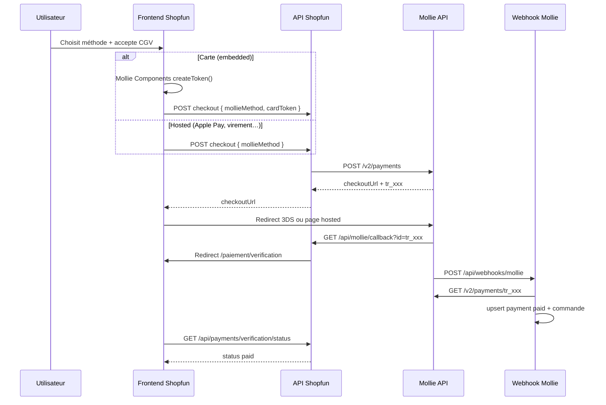

# Shopfun – Contexte : intégration paiements Mollie (méthode Greffio)

> **Usage** : ouvrir ce document dans Cursor **sur le projet Shopfun**, puis coller le prompt de `docs/PROMPT_SHOPFUN_INTEGRATION_PAIEMENTS_MOLLIE.md`.
>
> **Référence** : implémentation production Greffio SaaS (William Establishments) · snapshot 17 juin 2026.
>
> **Objectif** : reproduire **la même architecture** que Greffio — pas un bricolage Stripe/Mollie côté client, mais un flux serveur-first avec Mollie Components (carte embarquée), checkout hosted (Apple Pay, virement…), webhooks signés et statut `paid` **jamais** posé par le frontend.
>
> **PSP actif Greffio** : **Mollie uniquement** en B2C. CAWL / Google Pay / Amazon Pay sont dormants ou retirés. GoCardless = B2B uniquement (hors scope Shopfun sauf besoin pro explicite).

---

## Partie A – Instructions pour l’agent Cursor (Shopfun)

### Rôle

Tu intègres les paiements e-commerce Shopfun en **copiant le pattern Greffio** : couche API Mollie serveur, adapter multi-prestataires (Mollie actif), terminal checkout React, page de vérification post-retour, webhook Mollie comme source de vérité.

### Ce que tu dois produire (minimum viable Shopfun)

1. **Backend** : client Mollie (`server/mollie.js` équivalent), adapter (`MolliePaymentAdapter`), service de création paiement, routes API, webhook.
2. **Frontend** : terminal checkout (équivalent `GreffioPaymentTerminal`), formulaire carte Mollie Components, page vérification, helpers navigation checkout.
3. **Config** : variables d’environnement (clés **uniquement** dans `.env`, jamais commitées).
4. **Persistance** : table `payments` + `payment_events` (idempotence webhook).
5. **Dashboard Mollie** : profile, Components, webhook, redirect URL configurés pour les domaines Shopfun.

### Ce que tu ne dois PAS faire

| Interdit | Pourquoi |
|----------|----------|
| Exposer `MOLLIE_API_KEY` au frontend (Vite, mobile) | Secret serveur uniquement |
| Marquer une commande `paid` depuis le navigateur | Fraude / incohérence ; webhook ou poll serveur uniquement |
| Saisir le PAN carte hors Mollie Components | PCI-DSS ; token `cardToken` uniquement |
| Réimplémenter un second PSP B2C « en parallèle » sans resolver | Greffio centralise dans `PaymentProviderResolver` |
| Refonte globale UI Shopfun pour « harmoniser » | Terminal et pages paiement **locales** ; identité Shopfun préservée |
| Committer les clés API dans le repo ou ce document | `.env` / secrets CI uniquement |

### Checklist de validation fonctionnelle

- [ ] `GET /api/mollie/status` → `configured: true`, `profileId` correct.
- [ ] `GET /api/mollie/methods?amount=1000` → liste méthodes (carte, Apple Pay si activé…).
- [ ] Carte : formulaire Components → `cardToken` → `POST` checkout → redirect 3-D Secure si requis → retour callback.
- [ ] Apple Pay / virement : redirect hosted Mollie dès le clic « Payer ».
- [ ] Webhook `POST /api/webhooks/mollie` met à jour `payments.status = paid` et la commande Shopfun.
- [ ] Page `/paiement/verification` poll le serveur jusqu’à statut terminal.
- [ ] Montant recalculé **côté serveur** (jamais faire confiance au montant client seul).
- [ ] CSP / nginx : `js.mollie.com` autorisé (`script-src`, `frame-src`).

---

## Partie B – Architecture Greffio (référence à reproduire)

### B.1 Vue d’ensemble



### B.2 Principes invariantes (Greffio prod)

| Règle | Détail |
|-------|--------|
| B2C → Mollie seul | Pas de GoCardless, pas de CAWL actif |
| `paid` = webhook | Le frontend ne fait que poller / afficher |
| Carte = embedded | `Mollie Components` + `cardToken` → API |
| Wallets / virement = hosted | Redirect vers checkout Mollie |
| Profile ID public | `MOLLIE_PROFILE_ID` / `VITE_MOLLIE_PROFILE_ID` — pas la clé API |
| Idempotence webhook | Table `payment_events` avec `provider_event_id` unique |

### B.3 Couches backend Greffio

| Couche | Fichier Greffio | Responsabilité |
|--------|-----------------|----------------|
| Client HTTP Mollie | `server/mollie.js` | `createMolliePayment`, `listMollieMethods`, `retrieveMolliePayment`, normalisation méthodes |
| URLs callback/webhook | `server/config/mollieUrls.js` | `resolveMollieWebhookUrl`, `resolveMolliePaymentRedirectUrl` |
| Adapter | `server/payments/providers/MolliePaymentAdapter.js` | Bridge `PaymentService` ↔ API Mollie |
| Resolver | `server/payments/PaymentProviderResolver.js` | B2C → mollie ; règles flux métier |
| Service | `server/payments/PaymentService.js` | Création paiement, persistance, choix PSP |
| Factory | `server/payments/paymentServiceFactory.js` | Singleton avec deps store |
| Routes paiements | `server/routes/paymentsRoutes.js` | `POST /api/payments`, terminal-config, verification |
| Routes Mollie | `server/routes/mollieRoutes.js` | callback utilisateur, methods, diagnostic |
| Webhooks | `server/routes/webhookRoutes.js` | `handleMollieWebhook` |
| Checkout panier | `server/resourcesCartCheckout.js` | Paiement groupé (pattern e-commerce) |
| Checkout commande | `server/resourcesCheckout.js` | Une commande → un paiement |

**Enregistrement dans `server/index.js`** : `registerPaymentsRoutes`, `registerMollieRoutes`, `registerWebhookRoutes` ; body parser urlencoded pour webhooks Mollie.

### B.4 Routes API Greffio (à adapter Shopfun)

| Méthode | Route | Auth | Rôle |
|---------|-------|------|------|
| GET | `/api/payments/terminal-config` | Non | Config UI (profileId, testmode, flags) |
| GET | `/api/mollie/methods` | Non | Methods API Mollie (montant optionnel) |
| POST | `/api/payments` | Oui | Création paiement générique |
| POST | `/api/orders/:id/checkout` | Oui | **Shopfun** : checkout commande boutique |
| POST | `/api/cart/prepare` | Oui | Optionnel : préparer N lignes panier |
| POST | `/api/cart/pay` | Oui | Optionnel : un paiement pour tout le panier |
| GET | `/api/mollie/callback` | Non | Redirect Mollie → frontend verification |
| GET | `/api/mollie/status` | Non | Diagnostic ops |
| GET | `/api/payments/verification/status` | Oui | Poll statut post-retour |
| POST | `/api/webhooks/mollie` | Non | Webhook serveur (body `id=tr_xxx`) |

Alias webhook acceptés Greffio : `/webhooks/mollie`, `/api/mollie/webhook`.

### B.5 Client Mollie serveur — contrat clé

Fichier : `server/mollie.js`

```javascript
// Méthodes embedded vs hosted
export const MOLLIE_EMBEDDED_METHODS = ['creditcard'];
export const MOLLIE_HOSTED_METHODS = ['applepay', 'banktransfer', 'paypal', /* … */];

export const resolveMollieCheckoutMode = (method, cardToken) => {
  const normalized = normalizeMollieMethod(method);
  if (normalized === 'creditcard' && cardToken) return 'embedded_3ds';
  if (MOLLIE_EMBEDDED_METHODS.includes(normalized)) return 'embedded';
  return 'hosted';
};

// Création paiement
const body = {
  amount: { currency: 'EUR', value: (cents / 100).toFixed(2) },
  description,
  redirectUrl,
  webhookUrl,
  metadata,
  method,      // optionnel
  cardToken,   // si carte embedded
};
// POST https://api.mollie.com/v2/payments
```

**Metadata recommandée** (traçabilité webhook) :

```javascript
{
  internal_payment_id: '<uuid>',
  customer_id: '<userId>',
  order_id: '<shopfunOrderId>',
  payment_flow: 'resource', // ou shopfun_checkout
}
```

### B.6 Webhook Mollie — logique Greffio

Fichier : `server/routes/webhookRoutes.js` → `handleMollieWebhook`

1. Lire `req.body.id` (payment Mollie `tr_xxx`).
2. Trouver le paiement local via `getPaymentByProviderId`.
3. `retrieveMolliePayment` pour statut réel (ne pas faire confiance au body seul).
4. Idempotence : `providerEventId = ${tr_id}:${status}` dans `payment_events`.
5. Si `paid` : `upsertPayment`, puis **side-effect métier** :
   - Greffio : `handleResourceOrderPaymentPaid`, transition dossier, facture.
   - **Shopfun** : marquer commande `paid`, décrémenter stock, email confirmation, etc.
6. Répondre `200 { ok: true }` rapidement.

> Mollie n’envoie pas de signature HMAC standard sur tous les plans ; Greffio vérifie en **re-fetchant** le paiement avec la clé API. Ne pas marquer `paid` sur le seul POST webhook sans lookup API.

### B.7 Callback utilisateur (retour navigateur)

`GET /api/mollie/callback?id=tr_xxx&orderId=...`

1. Optionnel : `retrieveMolliePayment` pour `status` indicatif.
2. Redirect 302 vers `${APP_URL}/paiement/verification?molliePaymentId=tr_xxx&orderId=...`.

Le statut affiché au retour est **indicatif** ; la page verification **poll** le serveur.

### B.8 Schéma données (migration Greffio)

Fichier : `server/migrations/012_payments_multiprovider.sql`

Colonnes clés table `payments` :

- `id`, `user_id`, `customer_id`, `customer_type`
- `amount_total_cents`, `currency`, `status`
- `provider` (`mollie`), `provider_payment_id` (`tr_xxx`)
- `provider_checkout_url`, `payment_method`, `metadata_json`
- `paid_at`, `failed_at`
- lien métier : `resource_order_id` / `dossier_id` / `invoice_id` → **Shopfun** : `order_id`

Table `payment_events` : `payment_id`, `event_type`, `provider_event_id` (unique), `raw_payload`.

---

## Partie C – Frontend Greffio (référence)

### C.1 Arborescence cible Shopfun

```text
src/
  api/
    mollie.js              # fetchMollieMethods, fetchPaymentTerminalConfig
    payments.js            # initiatePayment, fetchPaymentVerificationStatus
  config/
    mollie.js              # VITE_MOLLIE_PROFILE_ID (public)
    paymentBrands.js       # logos Visa/MC/CB/Amex (voir doc footer Shopfun)
  components/
    payments/
      ShopfunPaymentTerminal.jsx   # adapté depuis GreffioPaymentTerminal
      MollieCardForm.jsx           # copie quasi identique
      MollieSecureTrustBadge.jsx   # « Paiements sécurisés effectués par Mollie »
      LegalAcceptanceCheckbox.jsx  # CGV/CGU avant paiement
      CheckoutOrderSummary.jsx     # récap commande
    layout/
      PaymentBrandBadges.jsx       # logos checkout floating
  pages/
    PaymentPage.jsx                # ou CheckoutPage.jsx
    PaymentVerificationPage.jsx
  utils/
    paymentCheckoutNavigation.js   # openPaymentCheckoutUrl (Capacitor si app native)
    paymentErrors.js               # messages utilisateur

public/images/payments/
  mollie-wordmark.svg
  visa-checkout.svg, mastercard-checkout.svg, …
```

### C.2 Terminal checkout — flux composant

Fichier référence : `src/components/payments/GreffioPaymentTerminal.jsx`

**Au montage** (si `amountCents > 0`) :

1. `GET /api/payments/terminal-config?customerType=b2c`
2. `GET /api/mollie/methods?amount=<cents>&locale=fr_FR`
3. Affiche sélecteur méthodes + `MollieCardForm` si `creditcard`.

**Au clic « Payer »** :

```javascript
let cardToken = null;
if (selectedMethod === 'creditcard') {
  const { token, error } = await cardFormRef.current.createToken();
  if (error) return;
  cardToken = token;
}
await onPay({ method: selectedMethod, cardToken });
```

**Parent (`PaymentPage`)** :

```javascript
const payload = await checkoutOrder(orderId, { mollieMethod: method, cardToken });
if (payload.checkoutUrl) {
  await openPaymentCheckoutUrl(payload.checkoutUrl);
}
```

Même pour carte embedded : Mollie renvoie souvent une `checkoutUrl` pour la étape 3-D Secure uniquement.

### C.3 Mollie Components (carte embarquée)

Fichier : `src/components/payments/MollieCardForm.jsx`

- Charge `https://js.mollie.com/v1/mollie.js` une seule fois.
- `Mollie(profileId, { locale: 'fr_FR', testmode })`.
- `mollie.createComponent('card', { styles })` monté dans un div.
- `createToken()` exposé via `ref` — **seule** sortie vers le backend.

Profile ID = `VITE_MOLLIE_PROFILE_ID` (public, préfixe `pfl_`).

### C.4 Embedded vs hosted

| Méthode Mollie | Mode Greffio | UX Shopfun |
|----------------|--------------|------------|
| `creditcard` | Embedded + 3DS redirect | Formulaire sur page Shopfun → token → API → redirect 3DS si besoin |
| `applepay` | Hosted | `openPaymentCheckoutUrl(checkoutUrl)` immédiat |
| `banktransfer` | Hosted | Idem |
| `paypal`, `ideal`, … | Hosted | Idem |

Constantes : `server/mollie.js` → `MOLLIE_EMBEDDED_METHODS`, `MOLLIE_HOSTED_METHODS`.

### C.5 Page vérification

Fichier : `src/pages/PaymentVerificationPage.jsx`

- Lit `molliePaymentId`, `orderId` depuis query string.
- Poll `GET /api/payments/verification/status` avec backoff `[2s, 3s, 5s, 8s, 12s]`, max 15 tentatives.
- États : `paid` / `authorized` → succès ; `failed` / `cancelled` / `expired` → échec.
- CTA : « Mes commandes », dashboard Shopfun.

### C.6 Mobile (si Shopfun a une app Capacitor)

Fichier : `src/utils/paymentCheckoutNavigation.js`

- Hosted + 3DS : `CapApp.openUrl({ url })` (navigateur système), pas WebView bloquée.
- Retour via deep link HTTPS → `/api/mollie/callback` → `/paiement/verification`.

### C.7 Trust UI & conformité

- `MollieSecureTrustBadge` : texte + wordmark Mollie (pas dans le footer réseaux carte).
- `PaymentBrandBadges floating` sous le terminal (logos Visa/MC/CB/Amex).
- `LegalAcceptanceCheckbox` obligatoire avant paiement (liens CGU/CGV Shopfun).
- Pages légales : mentionner Mollie comme prestataire de paiement.

---

## Partie D – Variables d’environnement Shopfun

> **Sécurité** : les clés API ne doivent **jamais** figurer dans ce document, dans le code source, ni dans git. Les renseigner dans `.env` local et secrets CI/CD uniquement.
>
> **Note** : aucune clé Shopfun n’a été fournie dans la demande initiale — compléter le bloc ci-dessous dans `.env` sur le projet Shopfun.

### D.1 Backend (`.env` serveur Shopfun)

```env
# ─── Mollie (obligatoire B2C) ───
MOLLIE_API_KEY=                    # live_xxx ou test_xxx — SECRET SERVEUR
MOLLIE_PROFILE_ID=                 # pfl_xxx — public côté Components
MOLLIE_TESTMODE=false              # true si clé test_

# URLs publiques Shopfun (adapter les domaines réels)
APP_URL=https://www.shopfun.fr     # frontend
API_PUBLIC_URL=https://api.shopfun.fr

# Optionnel si différent du défaut ${API_PUBLIC_URL}/api/...
MOLLIE_WEBHOOK_URL=https://api.shopfun.fr/api/webhooks/mollie
MOLLIE_CALLBACK_URL=https://api.shopfun.fr/api/mollie/callback

# Désactiver legacy si copié depuis Greffio
CAWL_ENABLED=false
```

### D.2 Frontend (`.env` Vite Shopfun)

```env
VITE_MOLLIE_PROFILE_ID=            # même pfl_xxx que MOLLIE_PROFILE_ID
VITE_API_BASE_URL=https://api.shopfun.fr
```

### D.3 Greffio prod (référence — ne pas réutiliser les clés)

```env
MOLLIE_PROFILE_ID=pfl_Q6vFPJDb7P
MOLLIE_CALLBACK_URL=https://greffio.willentreprises.com/api/mollie/callback
MOLLIE_WEBHOOK_URL=https://api.greffio.willentreprises.com/api/webhooks/mollie
```

Shopfun doit créer **son propre** website profile Mollie (ou sous-compte marchand dédié).

---

## Partie E – Configuration dashboard Mollie (Shopfun)

Checklist manuelle après déploiement :

1. **Website profile** live avec méthodes : carte, Apple Pay (si iOS), virement (si proposé).
2. **Mollie Components** activé : Developers → Website profiles → Components.
3. **Webhook** : `https://api.<domaine-shopfun>/api/webhooks/mollie` — statut OK dans le dashboard.
4. **Redirect URL** autorisée : `https://api.<domaine>/api/mollie/callback` (ou proxy nginx `/api` → backend).
5. **Nom marchand** : « Shopfun » (cohérent checkout Mollie).
6. **CSP** (si applicable) : `script-src` et `frame-src` incluent `https://js.mollie.com`.
7. **nginx / reverse proxy** : routes `/api/webhooks/mollie` et `/api/mollie/callback` vers le Node backend (pattern Greffio `server/hostinger-frontend.js`).

Test webhook : créer un paiement test `test_` key, vérifier réception et mise à jour commande.

---

## Partie F – Adaptation métier Shopfun vs Greffio

| Concept Greffio | Équivalent Shopfun suggéré |
|-----------------|----------------------------|
| `resource_order` | `order` / `cart_checkout` |
| `POST /api/resources/orders/:id/checkout` | `POST /api/orders/:id/checkout` |
| `POST /api/resources/cart/pay` | `POST /api/cart/pay` |
| `handleResourceOrderPaymentPaid` | `markOrderPaid(orderId, payment)` |
| `PAYMENT_FLOWS.RESOURCE` | `shopfun_checkout` ou `ecommerce` |
| Description Mollie `Greffio – …` | `Shopfun – Commande #REF` |
| Routes `/paiement`, `/paiement/verification` | Idem ou `/checkout`, `/checkout/confirmation` |

**Montants** : Greffio recalcule via `server/pricing.js` / catalogue. Shopfun doit recalculer depuis le **catalogue produits serveur** (prix TTC en centimes), pas depuis le panier client seul.

**Panier groupé** : un paiement Mollie, `metadata.resourceOrderIds: [id1, id2]` — au webhook, boucler sur tous les IDs pour marquer payé (voir `server/resourcesCartCheckout.js` + `handleResourceOrderPaymentPaid`).

---

## Partie G – Plan d’implémentation pas à pas (Shopfun)

### Étape 0 – Prérequis

1. Compte Mollie Shopfun + clés `test_` puis `live_`.
2. `.env` renseigné (section D).
3. Lire `docs/CONTEXTE_SHOPFUN_FOOTER_LOGOS_TRANSACTIONS_SECURISEES.md` pour les logos checkout/footer.

### Étape 1 – Backend minimal

1. Copier / adapter : `server/mollie.js`, `server/config/mollieUrls.js`.
2. Copier couche payments : `types.js`, `MolliePaymentAdapter.js`, `PaymentService.js`, `PaymentProviderResolver.js` (version simplifiée B2C-only acceptable).
3. Routes : `mollieRoutes.js`, extrait webhook Mollie de `webhookRoutes.js`, route checkout commande.
4. Migration SQL `payments` + `payment_events`.
5. Tester : `curl /api/mollie/status`, création paiement test.

### Étape 2 – Frontend terminal

1. Copier `MollieCardForm.jsx`, adapter styles couleurs Shopfun (pas la logique).
2. Créer `ShopfunPaymentTerminal.jsx` depuis `GreffioPaymentTerminal.jsx` (rename copy, liens légaux Shopfun).
3. `api/mollie.js`, `api/payments.js`.
4. Page checkout branchée sur `onPay` → API.

### Étape 3 – Retour & webhook

1. `PaymentVerificationPage.jsx` + route React.
2. `GET /api/mollie/callback` + poll verification.
3. Webhook → `markOrderPaid`.
4. Test bout en bout : carte test Mollie `4111111111111111`.

### Étape 4 – Production

1. Clés `live_`, webhook live, smoke test 1 €.
2. Mention Mollie dans CGV / mentions légales Shopfun.
3. Monitoring : logs `[mollie-webhook]`, alertes échec 502 retrieve.

### Étape 5 – Optionnel

- Panier multi-articles (`cart/prepare` + `cart/pay`).
- GoCardless B2B si Shopfun vend aux pros (hors scope B2C).
- App mobile Capacitor : `paymentCheckoutNavigation.js`.

---

## Partie H – Mapping fichiers Greffio → Shopfun

| Greffio (référence) | Rôle | Shopfun |
|--------------------|------|---------|
| `server/mollie.js` | Client API Mollie | Copier / adapter |
| `server/config/mollieUrls.js` | URLs callback/webhook | Domaines Shopfun |
| `server/payments/providers/MolliePaymentAdapter.js` | Adapter | Idem |
| `server/payments/PaymentService.js` | Orchestration | Idem |
| `server/payments/PaymentProviderResolver.js` | Routing PSP | Simplifier B2C si besoin |
| `server/routes/paymentsRoutes.js` | API paiements | Adapter routes commande |
| `server/routes/mollieRoutes.js` | Callback + methods | Idem |
| `server/routes/webhookRoutes.js` | Webhook Mollie | Extraire handler |
| `server/resourcesCheckout.js` | Checkout 1 commande | `orderCheckout.js` |
| `server/resourcesCartCheckout.js` | Panier groupé | Optionnel |
| `src/components/payments/GreffioPaymentTerminal.jsx` | Terminal UI | `ShopfunPaymentTerminal.jsx` |
| `src/components/payments/MollieCardForm.jsx` | Components | Copie |
| `src/pages/PaymentPage.jsx` | Page checkout | `CheckoutPage.jsx` |
| `src/pages/PaymentVerificationPage.jsx` | Post-paiement | Idem |
| `src/api/payments.js` | Client API | Adapter endpoints |
| `src/utils/paymentCheckoutNavigation.js` | Redirect hosted | Idem si mobile |
| `docs/PAYMENT_SYSTEM_ARCHITECTURE_2026-06-14.md` | Architecture | Lecture seule |
| `docs/PAYMENTS_ARCHITECTURE.md` | Règles métier PSP | Lecture seule |

---

## Partie I – Tests Greffio (à reproduire)

```bash
node --test server/payments/tests/mollieAdapter.test.js
node --test server/payments/tests/paymentService.test.js
node --test server/payments/tests/paymentProviderResolver.test.js
```

Tests manuels Mollie (clé `test_`) :

- Carte succès : `4111111111111111`, expiry futur, CVC 3 chiffres.
- 3DS test : suivre redirect Mollie test mode.
- Webhook : vérifier dans Mollie Dashboard → Webhooks → dernier appel.

---

## Partie J – Dépannage fréquent

| Symptôme | Cause probable | Action |
|----------|----------------|--------|
| `MOLLIE_NOT_CONFIGURED` | Clé absente serveur | `MOLLIE_API_KEY` dans `.env` API |
| Components ne monte pas | Profile ID faux / CSP | `VITE_MOLLIE_PROFILE_ID`, autoriser `js.mollie.com` |
| Paiement reste `pending` | Webhook non reçu | URL publique, firewall, nginx proxy |
| `PAYMENT_NOT_FOUND` webhook | `provider_payment_id` non persisté | Vérifier `upsertPayment` à la création |
| Redirect boucle | `APP_URL` incorrect | Aligner `APP_URL` et routes frontend |
| Montant incorrect | Confiance client | Recalculer prix catalogue serveur |

---

## Références Greffio (lecture seule)

| Élément | Chemin |
|---------|--------|
| Architecture paiement 2026 | `docs/PAYMENT_SYSTEM_ARCHITECTURE_2026-06-14.md` |
| Règles PSP | `docs/PAYMENTS_ARCHITECTURE.md` |
| Terminal modifications | `docs/PAYMENT_TERMINAL_MODIFICATIONS_2026-06-13.md` |
| Logos paiement footer | `docs/CONTEXTE_SHOPFUN_FOOTER_LOGOS_TRANSACTIONS_SECURISEES.md` |
| Client Mollie | `server/mollie.js` |
| Webhook | `server/routes/webhookRoutes.js` (l.92+) |
| Terminal React | `src/components/payments/GreffioPaymentTerminal.jsx` |

---

*Document généré pour réplication cross-projet (Shopfun ← Greffio). Mettre à jour les domaines et variables lors du déploiement Shopfun. Ne jamais committer de secrets.*
