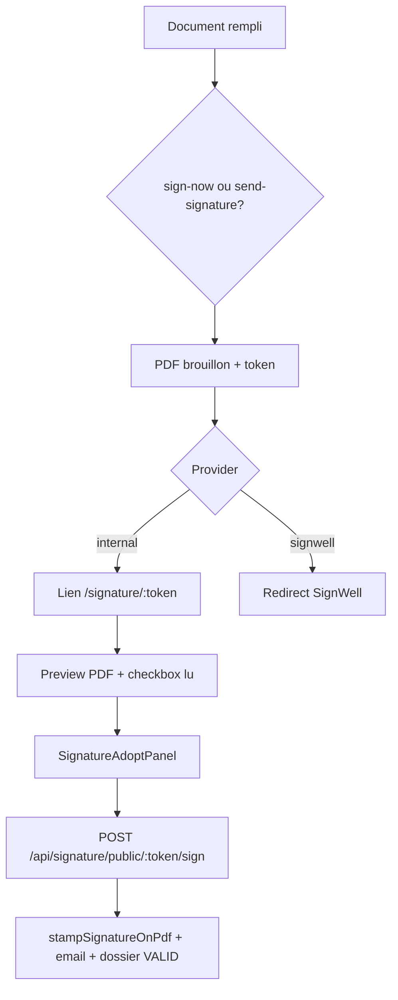

# Contexte Greffio – Signature, mobile & refonte UX (pour ChatGPT + Cursor)

> **Objectif de ce document** : donner à ChatGPT (ou tout autre assistant) le contexte complet pour co-concevoir avec Cursor les évolutions Greffio – signature documentaire, app mobile native, pages publiques cassées/lentes, et différenciation vs Legalstart / LegalPlace / Qonto.
>
> **Dernière mise à jour** : 13 juin 2026 – après correctifs login, pages mobile tarifs/services, refonte panneaux signature.

---

## 1. Produit & positionnement

| Élément | Valeur |
|--------|--------|
| **Marque** | Greffio (marque déposée de WILLIAM ESTABLISHMENTS) |
| **URL prod** | https://greffio.willentreprises.com |
| **API prod** | https://api.greffio.willentreprises.com |
| **Éditeur mobile** | App Android Capacitor (AAB 1.2.12, versionCode 261510011) |
| **Repo GitHub** | `TheWilliamUniverse/greffio` – branche `main` |
| **Hébergement frontend** | Hostinger Node.js (build Vite → `dist`, `npm run hostinger:start`) |
| **Backend** | VPS `/opt/greffio` – PM2 `greffio-api`, SQLite/Postgres |

**Positionnement** : SaaS de formalités d'entreprise (création, modification, greffe, documents) avec équipe ops intégrée – **pas** un simple générateur de statuts. Parcours : simulateur → questionnaire → dossier → pièces → signature → paiement → dépôt → Kbis.

**Références UX à imiter (sans copier)** :
- **Legalstart / LegalPlace** : catalogue formalités clair, cartes par catégorie, CTA « Démarrer », confiance juridique.
- **Qonto** : login épuré, fond clair `#f6f8fc`, boutons `rounded-2xl`, hiérarchie typographique forte, pas de double header.

---

## 2. Contraintes de marque (CRITIQUE)

Règle Cursor `.cursor/rules/preserve-brand-identity.mdc` :

| Interdit sans demande explicite | Autorisé |
|--------------------------------|----------|
| Landing `LandingPage.jsx` (hero, sections, CTA) | Features métier, API, mobile |
| Palette globale, tokens CSS, thème Tailwind | Texte local à une feature |
| Navbar/footer public desktop global | Corrections bug UI ponctuelles |
| Refonte cosmétique transversale login/paiement | **Exception** : l'utilisateur a demandé explicitement d'améliorer connexion, tarifs, services mobile |

**Tokens existants à réutiliser** (ne pas inventer une nouvelle palette) :
- `--greffio-blue`, `--greffio-blue-900`, `--greffio-citron`, `--greffio-mint`, `--greffio-coral`
- Fond mobile recommandé : `#f6f8fc`
- Coins : `rounded-2xl` / `rounded-3xl` sur mobile (pattern Qonto)

---

## 3. Architecture mobile

### 3.1 Shell & routing

```
Capacitor natif + route non exclue → MobileAppShell
Web <768px + route non exclue      → MobileWebShell
Desktop ≥768px                     → Header + contenu
```

**Routes exclues du shell** (`src/utils/platform.js`) :
- `/ops*`, `/signature/`, `/callback`

**Routes auth plein écran** (sans bottom nav) :
- `/login`, `/signup`, `/password-reset`, `/credentials-unlock`

**Cold start natif** (`NativeAppBootstrap.jsx`) :
- 1er lancement → `/app/welcome`
- Visiteur → `/app/home` (`NativeAppHomePage`)
- Connecté → dossier en cours ou `/dashboard`

**Bottom nav publique** (`MobilePublicBottomNav.jsx`) :
Accueil · Simuler · **Services** · **Tarifs** · Compte (`/login`)

### 3.2 Pattern Entry (mobile vs desktop)

Fichiers `src/mobile/entries/*Entry.jsx` :
```jsx
export const PricingEntry = () => (
  isCapacitorNative() || isMobileBrowserViewport()
    ? <MobilePricingPage />
    : <PricingPage />
);
```

| Route | Entry | Mobile | Desktop |
|-------|-------|--------|---------|
| `/tarifs` | `PricingEntry` | `MobilePricingPage` | `PricingPage` |
| `/services` | `ServicesEntry` | `MobileServicesPage` | `ServicesPage` |
| `/dashboard` | `DashboardEntry` | `MobileHomePage` | `DashboardPage` |

### 3.3 Bugs corrigés récemment (juin 2026)

| Bug | Cause | Fix |
|-----|-------|-----|
| `/login` → « Une erreur est survenue » | `nativeApp` utilisé avant déclaration (TDZ) | Réordonner `LoginPage.jsx` |
| Lenteur avant login | Splash auth global bloquait toute l'app | `AuthContext` : splash uniquement sur routes protégées |
| `/tarifs` crash | `usePricingMotion` non importé dans `PricingPage` | Import ajouté + page mobile dédiée |
| Tarifs/services « moches » | `NavbarDropdown` + shell mobile = double header | Pages mobile sans navbar desktop |
| Build Hostinger failed | Exports manquants (`nativeAppStorage`, `platform`) | Commits `645bcf9`, `c668181` |

---

## 4. Système de signature

### 4.1 Providers

Fichier maître : `server/services/signature/signatureProvider.js`

| Provider | Activation | Niveau juridique |
|----------|------------|------------------|
| **`greffio_internal`** (défaut) | Pas de `GREFFIO_SIGNATURE_PROVIDER=signwell` | SES – signature électronique simple |
| **SignWell** | `GREFFIO_SIGNATURE_PROVIDER=signwell` + `SIGNWELL_API_KEY` | SES (US, trial expiré – **à éviter**) |
| **Signaturit** | Stub `signaturit.service.js` – **non implémenté** | AES/QES possible – candidat futur |
| **Yousign** | Non câblé – **recommandé** pour eIDAS FR pas cher | AES/QES |

**Recommandation produit** : garder `greffio_internal` pour 90 % des docs ; brancher Yousign/Signaturit uniquement si formalité exige AES/QES.

### 4.2 Flux signature interne



**Routes backend** :
- `server/routes/nonConvictionSignatureRoutes.js` – déclaration non-condamnation
- `server/routes/editableDocumentSignatureRoutes.js` – pouvoirs, liste souscripteurs, etc.
- `server/pdf/stampSignatureOnPdf.js` – estampillage pdf-lib + empreinte GRF + ligne SES

**Frontend signature** :
- `src/pages/SignaturePublicPage.jsx` – page publique `/signature/:token`
- `src/components/signature/SignatureAdoptPanel.jsx` – panneau adopt (nom, email, généré/dessiné, consentement)
- `src/components/signature/SignatureDocumentAcknowledge.jsx` – « J'ai lu le document »
- `src/mobile/ui/MobileSignatureOverlay.jsx` – bottom sheet in-app

**Tables** : `signatures`, `signature_requests` (via stores)

### 4.3 Améliorations signature (juin 2026)

- UI claire fond blanc `#f6f8fc` (plus de thème sombre `#0f172a`)
- Mention SES explicite dans consentement et footer PDF
- `getSignatureLegalNotice()` / `getSignatureProofLine()` dans `signatureProvider.js`
- Empreinte PDF : `Greffio – signature électronique simple (SES)`

### 4.4 Pistes d'évolution signature (pour ChatGPT)

1. **Certificat de preuve PDF** téléchargeable post-signature (hash SHA256, IP, UA, horodatage)
2. **OTP email** avant signature publique (renforce identification)
3. **Intégration Yousign** via `signatureProvider` sans supprimer fallback interne
4. **Timeline dossier** : événement « Document signé » visible côté client et ops
5. **Signature in-app** : unifier `MobileSignatureOverlay` et `SignaturePublicPage` (même composant racine)

---

## 5. Pages publiques mobile – état & cibles UX

### 5.1 Connexion (`/login`)

**Fichier** : `src/pages/LoginPage.jsx`

| Contexte | UX cible |
|----------|----------|
| App native | Header bleu « Bon retour » + formulaire carte blanche `rounded-3xl`, bouton `h-12 rounded-2xl`, MFA auto-submit 6 chiffres |
| Mobile web | Logo + titre « Connexion », fond clair, pas de sidebar bleue desktop |
| Desktop | Layout 2 colonnes inchangé (identité validée) |

**Auth** : email/password, MFA TOTP/email/recovery, captcha Turnstile web uniquement (pas natif).

### 5.2 Tarifs (`/tarifs`)

**Fichier mobile** : `src/mobile/MobilePricingPage.jsx`

- Cartes empilées (Starter 0€, Formalité 70€ jeune, Cabinet)
- FAQ accordéon 5 questions
- CTA simulateur + contact
- **Ne pas** inclure `NavbarDropdown`

### 5.3 Services (`/services`)

**Fichier mobile** : `src/mobile/MobileServicesPage.jsx`

- Hero + 3 piliers (parcours, équipe, Kbis)
- Groupes : Création, Modification, Patrimoine, Vie sociale
- Cartes cliquables → `/service/:slug` ou routes catalogue
- Source données : `LEGAL_SERVICES` dans `src/config/catalog.js`

### 5.4 Accueil app native (`/app/home`)

**Fichier** : `src/mobile/NativeAppHomePage.jsx`

- Hero carte bleue + grille 3 colonnes (Dossier / Signature / Kbis)
- Quick links Services · Tarifs · Simuler
- Formalités populaires (4 cartes)
- CTAs connexion / inscription

---

## 6. Déploiement

### Frontend Hostinger
```bash
git push origin main
# → build auto npm run build
# Vérifier : hosting_listJsDeployments greffio.willentreprises.com
```

### Backend VPS
```bash
cd /opt/greffio && bash scripts/vps-deploy.sh
```

### Android AAB
```bash
npm run android:release  # ou script projet
# releases/android/greffio-1.2.12-261510011.aab
```

**Variables VPS signature** :
```env
# Recommandé – signature interne
# GREFFIO_SIGNATURE_PROVIDER=internal  (ou absent)
# Ne pas définir SIGNWELL_API_KEY si SignWell abandonné
```

---

## 7. Fichiers clés (cartographie)

```
src/
├── pages/
│   ├── LoginPage.jsx              # Connexion web + native
│   ├── PricingPage.jsx            # Desktop tarifs
│   ├── ServicesPage.jsx           # Desktop services
│   └── SignaturePublicPage.jsx    # Signature publique
├── mobile/
│   ├── MobilePricingPage.jsx      # Tarifs mobile
│   ├── MobileServicesPage.jsx     # Services mobile
│   ├── NativeAppHomePage.jsx      # Hub visiteur natif
│   ├── MobileAppShell.jsx         # Shell natif
│   └── entries/
│       ├── PricingEntry.jsx
│       └── ServicesEntry.jsx
├── components/signature/
│   ├── SignatureAdoptPanel.jsx
│   └── SignatureDocumentAcknowledge.jsx
└── utils/platform.js              # Shell, auth routes, exclusions

server/
├── services/signature/
│   ├── signatureProvider.js       # Résolution provider
│   ├── signwell.service.js        # Legacy SignWell
│   └── signaturit.service.js      # Stub futur
├── routes/
│   ├── nonConvictionSignatureRoutes.js
│   └── editableDocumentSignatureRoutes.js
└── pdf/stampSignatureOnPdf.js     # Estampillage PDF
```

---

## 8. Prompts suggérés pour ChatGPT (co-pilotage avec Cursor)

### Refonte UX mobile
> « En respectant les tokens Greffio (--greffio-blue, #f6f8fc, rounded-2xl), propose une refonte de [PAGE] inspirée Qonto/Legalstart : hiérarchie, espacements, micro-copy FR. Ne touche pas LandingPage.jsx. »

### Signature
> « Greffio utilise greffio_internal (SES) par défaut. Propose l'intégration Yousign en fallback optionnel dans signatureProvider.js, avec conservation du stamp pdf-lib et du flux /signature/:token. »

### Debug mobile
> « Route /tarifs crash sur mobile : vérifier PricingEntry, imports usePricingMotion, absence de NavbarDropdown dans MobilePricingPage. »

### Différenciation concurrentielle
> « Liste 5 axes où Greffio peut se différencier de Legalstart (équipe ops intégrée, assistant complétion PDF, signature sans abonnement tiers) sans refonte landing. »

---

## 9. Checklist QA mobile (avant release)

- [ ] `/login` – formulaire visible, pas d'erreur boundary, MFA natif auto-submit
- [ ] `/tarifs` – cartes pricing + FAQ, pas de double header
- [ ] `/services` – catalogue scrollable, liens service OK
- [ ] `/app/home` – quick links Services/Tarifs/Simuler
- [ ] `/signature/:token` – preview PDF, checkbox, panneau signature clair, succès
- [ ] Bottom nav – 5 onglets, Compte → login ou dashboard si connecté
- [ ] Build Hostinger – state `completed` (pas `failed` sur exports manquants)

---

## 10. Historique commits récents (référence)

| Commit | Sujet |
|--------|-------|
| `df8b020` | Assistant complétion PDF, signature interne, accès Ressources/Boutique |
| `8065167` | Fix crash /login + splash auth |
| `645bcf9` | Export markFreshNativePasswordLogin (build Hostinger) |
| `c668181` | Export isNativeAuthRoute (build MobileAppShell) |

---

*Document généré pour synchroniser ChatGPT et Cursor sur l'état Greffio – signature, mobile public, et roadmap UX. Modifier ce fichier à chaque livraison significative.*
