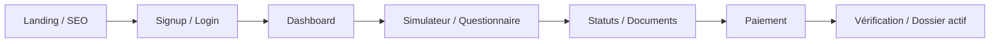

# Audit UI/UX complet – Greffio SaaS

**Date :** 13 juin 2026  
**Périmètre :** frontend React (`src/`), ~80 routes, 3 paradigmes de layout (marketing, client desktop, mobile), back-office Ops  
**Méthode :** revue code statique, inventaire routes/composants, analyse design tokens, patterns UX, responsive, maintenabilité  
**Contrainte projet :** l’identité globale validée (landing hero, palette globale, navbar publique, footer public, design system transversal) est **figée** sauf demande explicite – cet audit distingue les corrections **sans risque identité** des refontes **nécessitant validation produit**.

---

## Synthèse exécutive

Greffio possède une base produit solide (shadcn/Radix, tokens CSS, mobile natif Capacitor, ops séparé), mais l’interface souffre surtout de **fragmentation** :

| Signal | Impact |
|--------|--------|
| **3 design systems coexistent** (shadcn HSL, `we-*` William Enterprise, hex ad hoc) | Rendu « deux produits collés » entre marketing/wizard et espace client |
| **~10 features en double** (desktop page + mobile page) | Dérive visuelle et bugs UX au fil du temps |
| **5+ patterns de chargement / 3 patterns d’états vides** | Impression d’inachevé, manque de crédibilité premium |
| **Formulaires sans couche `Form` unifiée** | Validation, erreurs et champs incohérents |
| **Ops vs client : palettes différentes** | Acceptable en interne, mais legacy `/ops-legacy` brouille l’expérience |

**Score qualité perçue estimé :** 6,5/10 global – **7,5/10** sur le marketing figé, **5,5/10** sur l’espace client authentifié, **6/10** mobile web, **7/10** ops cockpit récent.

---

## 1. Structure générale

### 1.1 Trois layouts sans pont visuel clair

| Zone | Layout | Fichiers clés |
|------|--------|---------------|
| Marketing / SEO | `NavbarDropdown` + contenu page + footer partiel | `LandingPage.jsx`, `SeoPages.jsx`, `ServiceLandingPage.jsx` |
| Client authentifié desktop | `Header` + `Sidebar` par page | `Header.jsx`, `Sidebar.jsx`, `DashboardPage.jsx`… |
| Mobile | `MobileAppShell` / `MobileWebShell` + bottom nav | `MobileAppShell.jsx`, `MobileWebShell.jsx` |

**Problème :** passage login → dashboard change radicalement de langage visuel (marketing `we-*` / wizard hex → app shadcn compacte).

**Pourquoi c’est un problème :** rupture de confiance post-inscription ; l’utilisateur ne reconnaît pas le même produit premium.

**Recommandation :** harmoniser **l’espace authentifié** avec les tokens Greffio (`--greffio-blue`, `--greffio-blue-900`, ombres `shadow-elevation-*`) sans toucher la landing.

**Priorité :** important

**Correction concrète :** créer un `AppShell` client unique (`AuthenticatedLayout`) avec header/sidebar/content tokens ; migrer progressivement les pages dashboard.

---

### 1.2 Hiérarchie visuelle inégale entre pages client

| Page | Problème | Priorité |
|------|----------|----------|
| `DashboardPage.jsx` | Bonne hiérarchie (stats, CTA, empty state riche) | – |
| `DocumentsPage.jsx` | Bloc dense, chargement invisible, hiérarchie plate | important |
| `AnalyticsPage.jsx` | Empty state sans CTA vs dashboard | secondaire |
| `DossierDetailPage.jsx` | Beaucoup d’infos, progress inline non standardisé | important |
| `FormalityWizardPage.jsx` (~1771 lignes) | Surcharge cognitive, steps + sidebar + mobile dans un fichier | critique |

**Recommandation :** template de page client `PageHeader` (titre, breadcrumb, actions) + `PageSection` réutilisables.

---

### 1.3 Navigation : complexité et doublons

**Problème :** `Sidebar.jsx` liste 12+ entrées dont ops pour utilisateurs internes ; mobile utilise bottom tabs (5 items) – parcours différent.

**Fichiers :** `Sidebar.jsx`, `MobileAuthenticatedNav.jsx`, `WebMobileBottomNav.jsx`

**Pourquoi :** l’utilisateur mobile ne voit pas « Boutique », « Pilotage », « Assistant » au même niveau ; friction de découverte.

**Recommandation :** drawer « Plus » mobile regroupant les entrées secondaires ; badge cohérent dossiers.

**Priorité :** important

---

### 1.4 Footer public absent sur la majorité des pages

**Problème :** `GreffioUltraFooter` seulement sur `LandingPage.jsx` et `SeoPages.jsx`. Pages `/contact`, `/tarifs`, `/mentions-legales`, `/login` n’ont pas de footer unifié.

**Pourquoi :** crédibilité légale/SEO ; utilisateur perdu en bas de page.

**Recommandation :** layout public `PublicPageLayout` avec footer légal minimal (sans refonte visuelle du footer existant).

**Priorité :** important  
**Note identité :** réutiliser le footer existant tel quel, pas de redesign.

---

### 1.5 Routes orphelines / dette produit

| Fichier | Problème |
|---------|----------|
| `ProjectsPage.jsx`, `ProjectDetailPage.jsx` | Aucune route – code mort |
| `/ops-legacy` | Coexiste avec `/ops/*` – double back-office |
| `WalletPaymentTerminal.jsx` | Supersédé par `GreffioPaymentTerminal` |
| `MobileAuthShell.jsx` | Jamais importé |

**Priorité :** secondaire (nettoyage) / **important** pour ops-legacy (confusion équipe)

---

## 2. UI design

### 2.1 Typographies

**Constat :**
- Corps : Inter (global `body`)
- Titres : Plus Jakarta Sans (`h1–h6` dans `index.css`)
- Logo : police custom dans `GreffioLogo.jsx` (`style={{ fontFamily }}`)

**Problème :** mélange `font-extrabold` / `font-bold` / `font-black` sans échelle documentée ; eyebrow marketing `we-hero-eyebrow` (10px, tracking 0.28em) vs labels app `text-xs font-semibold`.

**Pourquoi :** hiérarchie typographique perçue comme « bricolée » sur les longs formulaires.

**Recommandation :** fichier `typography.js` ou classes utilitaires `text-display`, `text-title`, `text-body`, `text-caption` mappées aux tokens.

**Priorité :** important

---

### 2.2 Couleurs et double palette

**Tokens officiels (`index.css`) :**
- shadcn : `--primary`, `--muted`, `--destructive`…
- Greffio : `--greffio-blue`, `--greffio-citron`, `--greffio-mint`
- William Enterprise : `--we-blue`, `--we-bg`, `--we-border` (hex bruts)

**Palette parallèle non tokenisée (47 fichiers JSX) :**
- `#d4e2f5`, `#fafcff`, `#e2ebf8` – questionnaire / wizard
- `#0f1f3d`, `#0a1220` – navbar CTA
- `#f6f8fc` – mobile splash / shell

**Problème :** maintenance impossible ; contrastes non audités WCAG sur les hex locaux.

**Recommandation :** mapper la palette wizard vers CSS vars (`--greffio-field-border`, `--greffio-surface-soft`) **dans les composants questionnaire uniquement**.

**Priorité :** critique (maintenabilité + cohérence parcours principal)

**Correction concrète :**

```css
/* index.css – exemple, sans toucher --primary global */
--greffio-field-border: 214 40% 88%;
--greffio-surface-soft: 214 60% 98%;
```

Puis remplacer `#d4e2f5` dans `QuestionnairePage.jsx`, `StepLayout.jsx`, `FormalityWizardPage.jsx`.

---

### 2.3 Boutons

**Fichier de référence :** `src/components/ui/button.jsx`

**Problèmes observés :**

| Problème | Où | Priorité |
|----------|-----|----------|
| `rounded-full` par défaut vs `rounded-2xl` mobile | `button.jsx` vs `MobileEmptyState.jsx`, `MobileHomePage.jsx` | important |
| `variant="outline" className="bg-white"` répété 25+ fois | Dashboard, Payment, Ops, Documents… | important |
| CTA navbar bypass tokens : `bg-[#0f1f3d]` | `NavbarDropdown.jsx` | secondaire (identité figée) |
| Actions danger en `text-red-600` au lieu de `variant="destructive"` | Questionnaire, Documents | important |
| Lien styled à la main | `SignWellCallbackPage.jsx` (`bg-[#1F6F78]`) | secondaire |

**Recommandation :**
- Ajouter variant `outlineSolid` ou inclure `bg-white` dans `outline`
- Variante mobile `size="mobile"` → `h-12 rounded-2xl`
- Remplacer les `<a>` stylés par `<Button asChild>`

---

### 2.4 Cards, radius, ombres

**3 familles concurrentes :**

| Famille | Radius | Ombre | Usage |
|---------|--------|-------|-------|
| shadcn `Card` | `--radius` 0.5rem | `shadow-sm` | App client |
| `.we-card` | 22px | custom rgba | Wizard, services |
| Payment terminal | 28px | `0_28px_80px_rgba(30,77,140,0.14)` | `GreffioPaymentTerminal.jsx` |

**Problème :** même page paiement mélange `border-border` (sidebar) et terminal custom hex.

**Recommandation :** documenter 3 niveaux d’élévation (`sm/md/lg` déjà dans CSS) et les appliquer partout hors landing figée.

**Priorité :** important

---

### 2.5 Inputs et champs

**Baseline :** `ui/input.jsx` – `h-9`, `rounded-md`

**Divergences :**

| Pattern | Fichier | Problème |
|---------|---------|----------|
| `h-14 rounded-2xl border-2 border-[#d4e2f5]` | `QuestionnairePage.jsx`, `QuestionSelect.jsx` | UX mobile OK, style isolé |
| `h-12` login mobile only | `LoginPage.jsx` | Incohérent avec Signup |
| Raw `<select>` | `DossiersPage.jsx` | Ne match pas `Select` shadcn |
| `form.jsx`, `field.jsx` | `ui/` | **0 usage** – primitives mortes |

**Priorité :** critique pour questionnaire (volume traffic) ; important pour auth.

**Correction :** composant `GreffioField` encapsulant Input/Select + label + error + `h-12 md:h-10`.

---

### 2.6 États interactifs (hover, focus, disabled)

**Points forts :** `button.jsx` hover `-translate-y-0.5` ; `interactive-hover` utility.

**Faiblesses :**
- Focus ring incohérent sur champs custom questionnaire (border color change seulement)
- `Header.jsx` : cloche notification avec point rouge **sans notification réelle** – crédibilité
- Disabled states parfois seulement `opacity-50` sans message

**Priorité :** important (cloche) / secondaire (focus questionnaire)

---

### 2.7 Icônes

**Librairie :** Lucide – cohérent.

**Problème :** tailles alternent `h-4 w-4`, `h-5 w-5`, `h-6 w-6` sans règle ; ops et client OK mais emojis/absence d’icônes sur empty states ops.

**Priorité :** secondaire

---

## 3. UX

### 3.1 Parcours utilisateur principal



**Frictions identifiées :**

| Étape | Friction | Fichiers | Priorité |
|-------|----------|----------|----------|
| Signup → Dashboard | Rupture visuelle | `SignupPage.jsx`, `DashboardPage.jsx` | important |
| Questionnaire long | Pas de sauvegarde visible / progression duplicate | `QuestionnairePage.jsx`, `StepLayout.jsx` | critique |
| Documents sans dossier | Message ambre peu actionnable | `DocumentsPage.jsx` | important |
| Paiement | Google Pay TEST vs live pas clair avant clic (amélioré récemment) | `GreffioPaymentTerminal.jsx` | important |
| Retour paiement | Deux URLs verification + amazon retour | `PaymentVerificationPage.jsx` | secondaire |

---

### 3.2 CTA – cohérence

| CTA | Comportement | Problème |
|-----|--------------|----------|
| « Créer mon espace » | `/signup` (NavbarDropdown) | OK post-commit |
| « Nouvelle démarche » | `/simulateur` sidebar | OK |
| Empty dashboard | CTA vers simulateur | OK |
| Analytics vide | **Pas de CTA** | important |
| Boutique | Peu visible mobile (hors tab bar) | important |

---

### 3.3 Formulaires et validation

| Page | Feedback erreur | Problème | Priorité |
|------|-----------------|----------|----------|
| `LoginPage.jsx` | Toast uniquement | Pas d’erreur sous email/password | important |
| `SignupPage.jsx` | Mix toast + inline checkbox | OK partiel | secondaire |
| `ProfilePage.jsx` | Inline `text-destructive` + toast | Bon modèle à généraliser | – |
| `QuestionnairePage.jsx` | `text-red-600`, bordures rouges | Palette erreur non token | important |
| `ContactPage.jsx` | Toast success/error | Pas de validation inline champs vides | secondaire |

**Recommandation :** standard `FieldError` + `aria-invalid` sur tous les flows auth et questionnaire.

---

### 3.4 États de chargement

| Pattern | Exemples | Problème |
|---------|----------|----------|
| Texte « Chargement… » | Dashboard, Ops, Payment | Amateur vs skeleton |
| `MobilePageSkeleton` | Mobile dossiers/documents | Bien – non réutilisé web |
| `animate-pulse` custom | Dashboard stat cards | Dupliqué |
| `AppBootSplash` | Auth boot | Bien |
| Rien | `DocumentsPage.jsx` loading dossiers | **Critique UX** |

**Code mort :** `LoadingSpinner.jsx`, `ui/spinner.jsx` peu utilisés ; `ui/skeleton.jsx` sous-utilisé.

**Priorité :** critique (Documents) ; important (standardisation globale)

**Correction :** composant `PageLoadingState` + `ContentSkeleton` ; remplacer texte seul.

---

### 3.5 États vides

| Qualité | Où |
|---------|-----|
| ⭐⭐⭐ Rich (icône + titre + CTA) | `DashboardPage`, `DossiersPage`, `MobileEmptyState` |
| ⭐⭐ Moyen | `AnalyticsPage` (sans CTA) |
| ⭐ Minimal | Ops (`OpsFilteredDossiersPage` – texte slate) |
| Mort | `ui/empty.jsx` jamais importé |

**Priorité :** important (unifier via `EmptyState` wrapper autour de `ui/empty.jsx`)

---

### 3.6 Messages d’erreur et toasts

**Système actif :** Sonner (`App.jsx` – `richColors`, `top-right`)

**Problèmes :**
- Double feedback toast + inline (`NonConvictionDeclarationPage.jsx`)
- `text-red-600` vs `text-destructive` vs amber ops
- Legacy mort : `NotificationToast.jsx`, `ui/toaster.jsx`, `hooks/use-toast`

**Priorité :** important (standard) ; secondaire (nettoyage dead code)

---

### 3.7 Feedback utilisateur – cas particuliers

| Cas | Problème | Priorité |
|-----|----------|----------|
| Header cloche | Badge rouge permanent fictif | **critique** (crédibilité) |
| Upload documents | Texte bouton « Upload… » OK | – |
| Signature publique | Fond `#0f172a` isolé du reste | secondaire (contexte signing) |
| MFA login | Bon flow OTP | – |

---

## 4. Responsive

### 4.1 Stratégie actuelle

- **Desktop :** pages dédiées + Sidebar
- **Mobile browser / native :** entries switch vers `Mobile*Page.jsx` ou prop `presentation="mobile"`
- **Landing :** split CSS `md:hidden` / `hidden md:block` dans `LandingPage.jsx`

**Problème structurel :** double maintenance (ex. `DocumentsPage.jsx` 649 lignes + `MobileDocumentsPage.jsx` 409 lignes).

**Priorité :** important (stratégie long terme) – pas urgent de tout fusionner, mais **design tokens communs** obligatoires.

---

### 4.2 Mobile

| Problème | Fichier | Priorité |
|----------|---------|----------|
| Safe area bottom nav | `index.css` warning calc invalide (`bottomNavVar+env`) | important |
| Login `h-12` inputs, Signup non harmonisé | `LoginPage.jsx`, `SignupPage.jsx` | important |
| Payment terminal `max-w-2xl` OK mais dense sur petit écran | `GreffioPaymentTerminal.jsx` | secondaire |
| Public bottom nav vs authenticated | 2 composants | secondaire |

---

### 4.3 Tablette (768–1024px)

**Problème :** Sidebar `hidden md:flex` → header seul entre 768–1024 ; contenu parfois trop large (`max-w-7xl`) sans colonne latérale – pages « flottantes ».

**Recommandation :** breakpoint `lg` pour sidebar ou drawer tablet.

**Priorité :** important

---

### 4.4 Desktop large

Peu de problèmes ; `GreffioPaymentTerminal` bien centré `max-w-2xl`. Dashboard pourrait utiliser grilles 12 colonnes sur `xl`.

**Priorité :** secondaire

---

## 5. Qualité perçue

### 5.1 Ce qui donne un rendu amateur

1. Texte « Chargement… » sans spinner (Ops, Documents, Payment resource load)
2. Empty states ops = paragraphe gris
3. Cloche notification factice
4. Mélange `text-red-600` / `text-destructive`
5. Boutons outline + `bg-white` copiés partout
6. Wizard/questionnaire : champs magnifiques mais **isolés** du reste de l’app
7. Code mort (Projects, WalletPaymentTerminal, toasts legacy)

### 5.2 Ce qui manque de finition premium

- Transitions de page homogènes (Framer Motion utilisé sur login/payment terminal, pas dashboard)
- Micro-interactions cohérentes sur cards dossiers
- Skeletons branded (bleu Greffio subtil)
- Breadcrumbs systématiques (`DossierBreadcrumb.jsx` existe mais usage partiel)
- Focus management après navigation wizard

### 5.3 Ce qui nuit à la crédibilité produit

- Google Pay en TEST sans encaissement live (message OK récemment, mais produit SaaS payant)
- Double ops (`/ops` vs `/ops-legacy`)
- Pages légales sans footer cohérent
- Erreurs login génériques toast-only

### 5.4 Ce qui fonctionne déjà (à préserver)

- Landing / identité marketing (figée, qualité perçue bonne)
- `GreffioPaymentTerminal` – direction premium correcte
- Dashboard empty state + pulse stats
- Ops cockpit récent (slate pro)
- Auth MFA + captcha progressive
- Mobile empty states structurés

---

## 6. Code front-end / design system

### 6.1 Composants dupliqués

| Doublon | Fichiers | Action |
|---------|----------|--------|
| Payment terminal | `WalletPaymentTerminal` → `GreffioPaymentTerminal` | Supprimer alias après migration imports |
| Loading | `LoadingSpinner`, pulse inline, text | Unifier `PageLoadingState` |
| Empty | `MobileEmptyState`, inline web, `ui/empty` | Unifier `EmptyState` |
| Progress | inline `style={{ width }}` × 8 fichiers | Utiliser `ui/progress.jsx` partout |
| Mobile/Desktop pages | 10 paires | Tokens communs + composants partagés |

### 6.2 Architecture UI recommandée

```
src/components/layout/
  AuthenticatedLayout.jsx   ← Header + Sidebar + main
  PublicPageLayout.jsx      ← Navbar + footer légal
  PageHeader.jsx
  PageSection.jsx

src/components/patterns/
  EmptyState.jsx            ← wrap ui/empty
  PageLoadingState.jsx
  FieldError.jsx
  GreffioField.jsx

src/styles/
  greffio-surfaces.css      ← vars wizard/questionnaire (pas toucher landing)
```

### 6.3 Incohérences design system

| Primitive shadcn | État |
|------------------|------|
| `form.jsx`, `field.jsx` | Non utilisés |
| `empty.jsx` | Non utilisé |
| `skeleton.jsx`, `spinner.jsx` | Sous-utilisés |
| `progress.jsx` | Sous-utilisé vs inline widths |
| `sidebar.jsx` (shadcn) | Projet utilise `Sidebar.jsx` custom |

**Priorité :** important – either adopt or delete unused primitives.

---

## 7. Findings détaillés par zone (format standard)

Légende priorité : 🔴 critique · 🟠 important · 🟡 secondaire

---

### Marketing & SEO (sans refonte landing figée)

| # | Endroit | Problème | Pourquoi | Recommandation | Prio | Correction concrète |
|---|---------|----------|----------|----------------|------|---------------------|
| M1 | `/contact`, `/tarifs`, pages légales | Pas de footer unifié | Crédibilité, liens légaux | `PublicPageLayout` + `GreffioUltraFooter` | 🟠 | Wrapper layout sans changer footer design |
| M2 | `NotFoundPage.jsx` | Fond `var(--we-bg)` seul | OK visuellement mais hors shell public | Inclure navbar + footer | 🟡 | Wrap dans public layout |
| M3 | 30+ routes SEO | Navbar marketing only | Navigation OK | Vérifier CTA secondaires cohérents | 🟡 | Audit CTA par hub |

---

### Auth

| # | Endroit | Problème | Pourquoi | Recommandation | Prio | Correction |
|---|---------|----------|----------|----------------|------|------------|
| A1 | `LoginPage.jsx` | Erreurs toast-only | Accessibilité, clarté | Inline sous champs | 🟠 | `FieldError` + `aria-invalid` |
| A2 | `LoginPage` vs `SignupPage` | Inputs mobile h-12 vs default | Incohérence | Shared `authInputClass` hook | 🟠 | `useAuthFormStyles()` |
| A3 | `CredentialsUnlockPage.jsx` | `text-red-600` | Token break | `text-destructive` | 🟡 | Remplacer classe |
| A4 | `MobileAuthShell.jsx` | Non utilisé | Dette | Supprimer ou brancher signup mobile | 🟡 | Delete ou intégrer |

---

### Espace client (dashboard, dossiers, documents)

| # | Endroit | Problème | Pourquoi | Recommandation | Prio | Correction |
|---|---------|----------|----------|----------------|------|------------|
| C1 | `Header.jsx` L48-50 | Badge notif permanent | Fausse alerte | Cacher si count=0 ou implémenter notifs | 🔴 | `{count > 0 && <span…/>}` |
| C2 | `DocumentsPage.jsx` | Loading invisible | UX cassée | Skeleton liste docs | 🔴 | `if (loading) return <PageLoadingState/>` |
| C3 | `AnalyticsPage.jsx` | Empty sans CTA | Dead-end | CTA « Créer une démarche » | 🟠 | Copier pattern Dashboard |
| C4 | `DossiersPage.jsx` | `<select>` natif | Style break | `Select` shadcn | 🟠 | Remplacer composant |
| C5 | Dashboard / Dossiers / Detail | Progress inline width | Duplication | `Progress value={n}` | 🟠 | Refactor 8 fichiers |
| C6 | `Sidebar.jsx` | 12 liens plats | Surcharge | Groupes « Opérations » / « Compte » | 🟡 | `SidebarGroup` labels |

---

### Questionnaire & simulateur

| # | Endroit | Problème | Pourquoi | Recommandation | Prio | Correction |
|---|---------|----------|----------|----------------|------|------------|
| Q1 | `FormalityWizardPage.jsx` | 1771 lignes monolithiques | Maintenabilité | Split steps + hooks | 🔴 | Extraire `wizard/steps/*` |
| Q2 | `QuestionnairePage.jsx`, `StepLayout.jsx` | Hex `#d4e2f5` etc. | DS break | CSS vars Greffio field | 🔴 | Tokeniser (local feature) |
| Q3 | `QuestionSelect.jsx` | Champs custom non Input | Accessibilité | `GreffioField` | 🟠 | Wrapper commun |
| Q4 | Erreurs questionnaire | `text-red-600` | Incohérence | `text-destructive` | 🟠 | Replace all |

---

### Paiement

| # | Endroit | Problème | Pourquoi | Recommandation | Prio | Correction |
|---|---------|----------|----------|----------------|------|------------|
| P1 | `PaymentPage.jsx` | « Chargement… » texte seul resource order | Finition | Skeleton order summary | 🟠 | Skeleton block |
| P2 | `GreffioPaymentTerminal.jsx` | Hex custom lourd | DS local OK mais isolé | Mapper vers vars `--greffio-*` | 🟡 | Refactor classes |
| P3 | Google Pay TEST | Pas encaissement live | Crédibilité B2C | Bandeau global page paiement | 🟠 | Alert si mode=test |
| P4 | Sidebar payment + terminal | Deux langages visuels | Harmonie | Aligner bordures sur tokens | 🟡 | `border-border` terminal header |

---

### Signature & PDF

| # | Endroit | Problème | Pourquoi | Recommandation | Prio | Correction |
|---|---------|----------|----------|----------------|------|------------|
| S1 | `SignaturePublicPage.jsx` | Full dark `#0f172a` | Hors charte app | Acceptable contexte sign | 🟡 | Garder, harmoniser typo |
| S2 | `PdfPreviewPanel.jsx` | Chrome `#1e293b` | Isolé | Token dark surface | 🟡 | Var `--greffio-preview-chrome` |

---

### Ops back-office

| # | Endroit | Problème | Pourquoi | Recommandation | Prio | Correction |
|---|---------|----------|----------|----------------|------|------------|
| O1 | `/ops-legacy` vs `/ops` | Double UI | Confusion équipe | Redirect legacy → cockpit | 🟠 | Deprecate + redirect |
| O2 | Ops pages | `text-slate-*` vs tokens | OK interne | Documenter ops theme | 🟡 | `ops-theme` class scope |
| O3 | Ops loading/empty | Texte minimal | Pro interne mais faible | Réutiliser EmptyState allégé | 🟠 | Shared ops patterns |
| O4 | `OpsDossierDetailPage` | Loader2 vs text ailleurs | Incohérence | Standard spinner row | 🟡 | Unifier |

---

### Mobile

| # | Endroit | Problème | Pourquoi | Recommandation | Prio | Correction |
|---|---------|----------|----------|----------------|------|------------|
| MO1 | `index.css` L1045 | calc safe-area invalide | Bug CSS mobile | Espacer calc : `+ env(...)` | 🟠 | Fix syntax |
| MO2 | Entries pattern | 10 pages dupliquées | Drift | Shared sections | 🟠 | Extract `DossierList` shared |
| MO3 | Tab bar vs sidebar | Features cachées | Découvrabilité | Drawer « Plus » | 🟠 | Menu sheet |

---

## 8. Accessibilité (transversal)

| Problème | Où | Prio |
|----------|-----|------|
| Erreurs non liées aux champs (`aria-describedby`) | Login, Contact | 🟠 |
| Focus trap modales – OK Radix | Dialogs | – |
| Contraste hex `#d4e2f5` borders | Questionnaire | 🟡 – vérifier WCAG |
| `aria-expanded` accordéon payment | GreffioPaymentTerminal | ✅ présent |
| Font size 16px inputs mobile | `index.css` media query | ✅ bon |

---

## 9. Performance perçue UI

| Item | Impact | Prio |
|------|--------|------|
| Lazy routes ops – OK | Bon | – |
| Bundle `index-*.js` ~1,9 Mo | LCP | 🟠 – code split payment/wizard |
| Framer Motion multiple pages | OK | 🟡 |
| Images formalités PNG non WebP partout | Bandwidth | 🟡 |

---

## 10. Roadmap de correction

### Niveau 1 – Corrections urgentes (1–2 semaines)

Objectif : crédibilité immédiate, bugs UX visibles.

| # | Action | Fichiers principaux |
|---|--------|---------------------|
| 1 | Retirer badge notification fictif ou brancher vrai count | `Header.jsx` |
| 2 | Loading visible Documents | `DocumentsPage.jsx` |
| 3 | Tokeniser couleurs questionnaire/wizard (`#d4e2f5` → vars) | `QuestionnairePage`, `StepLayout`, `FormalityWizardPage` |
| 4 | Standard erreurs login inline | `LoginPage.jsx` |
| 5 | Fix CSS safe-area bottom nav | `index.css` |
| 6 | Google Pay : bandeau TEST visible page paiement | `PaymentPage`, `GreffioPaymentTerminal` |
| 7 | Supprimer code mort évident | `ProjectsPage`, `WalletPaymentTerminal`, `LoadingSpinner`, toasts legacy |

**Effort estimé :** 3–5 jours dev  
**Impact :** fort sur confiance utilisateur

---

### Niveau 2 – Améliorations importantes (3–6 semaines)

Objectif : cohérence design system espace client + mobile.

| # | Action |
|---|--------|
| 1 | Créer `EmptyState`, `PageLoadingState`, `GreffioField`, `PageHeader` |
| 2 | Migrer Dashboard, Dossiers, Documents, Analytics vers patterns |
| 3 | Unifier boutons (variant outline, size mobile) – `button.jsx` |
| 4 | Remplacer progress inline par `Progress` component |
| 5 | `PublicPageLayout` + footer sur contact/tarifs/légal |
| 6 | Auth mobile harmonisé Login/Signup |
| 7 | Split `FormalityWizardPage` en modules |
| 8 | Redirect `/ops-legacy` → `/ops/cockpit` |
| 9 | Tablet : sidebar drawer ou breakpoint `lg` |
| 10 | Adopter `ui/empty.jsx` ou supprimer |

**Effort estimé :** 2–3 sprints  
**Impact :** produit perçu « SaaS premium » cohérent

---

### Niveau 3 – Finitions premium (6–12 semaines)

Objectif : polish, réduction dette, performance.

| # | Action |
|---|--------|
| 1 | `AuthenticatedLayout` unique – réduire duplication mobile/desktop progressivement |
| 2 | Motion design system (transitions page, stagger lists dossiers) |
| 3 | Skeletons branded Greffio |
| 4 | Consolidation mobile pages (documents, dossier detail) composants partagés |
| 5 | Code split wizard + payment + ops chunks |
| 6 | Audit WCAG complet + corrections |
| 7 | Dark mode cohérent (tokens `.dark` existent mais peu utilisés) |
| 8 | Storybook / catalogue composants Greffio interne |
| 9 | Harmonisation ops theme documentée (slate scope) |
| 10 | Refonte **uniquement si validée** : navbar/footer global (hors scope auto) |

**Effort estimé :** roadmap trimestrielle  
**Impact :** différenciation premium long terme

---

## 11. Matrice priorisation (impact × effort)

```
Impact élevé, effort faible (FAIRE EN PREMIER)
├── Header notification badge
├── Documents loading state
├── Login inline errors
├── CSS safe-area fix

Impact élevé, effort moyen
├── Questionnaire color tokens
├── EmptyState / LoadingState shared
├── FormalityWizard split
├── Public footer layout

Impact moyen, effort élevé
├── Fusion mobile/desktop pages
├── AuthenticatedLayout unifié
└── Storybook DS complet
```

---

## 12. Conclusion

Greffio n’a pas un problème de « mauvais design » sur le marketing – il a un problème de **continuité** entre surfaces. L’utilisateur voit un produit soigné sur la landing et le wizard, puis un back-office client plus utilitaire, avec des états de chargement et des erreurs hétérogènes.

La voie recommandée **sans toucher l’identité figée** :

1. Tokeniser les flows à fort trafic (questionnaire, paiement, auth)
2. Introduire 4–5 composants patterns (`PageLoadingState`, `EmptyState`, `GreffioField`, `PageHeader`, `AuthenticatedLayout`)
3. Éliminer les signaux « amateur » (fausses notifs, chargements invisibles, erreurs toast-only login)
4. Planifier la convergence mobile/desktop par composants partagés, pas par big-bang responsive

---

*Audit réalisé par analyse statique du dépôt Greffio SaaS – juin 2026. Aucune modification de code effectuée dans le cadre de cet audit.*
